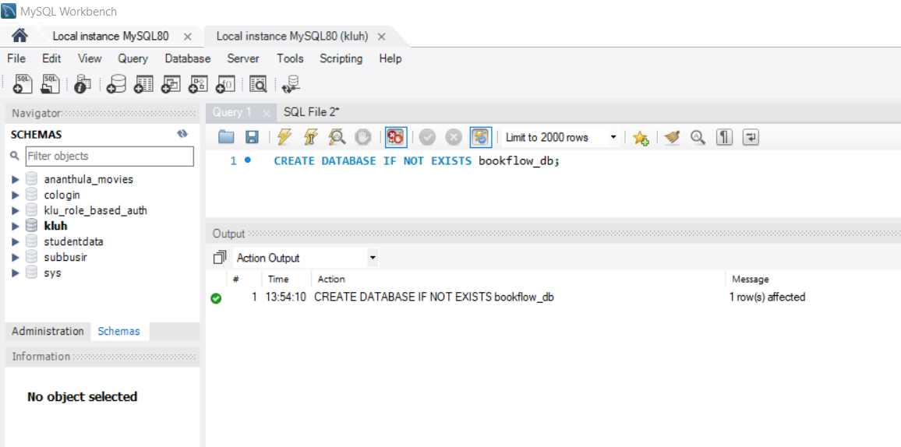
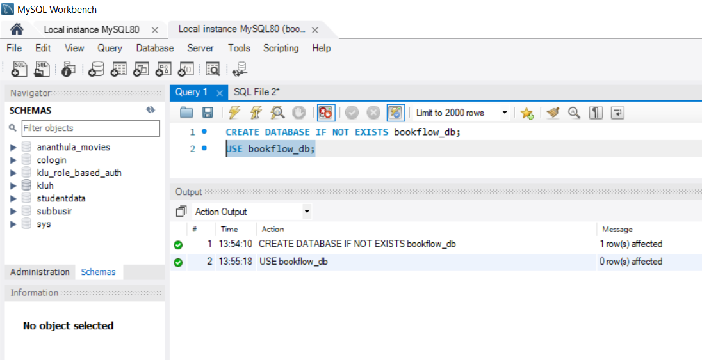
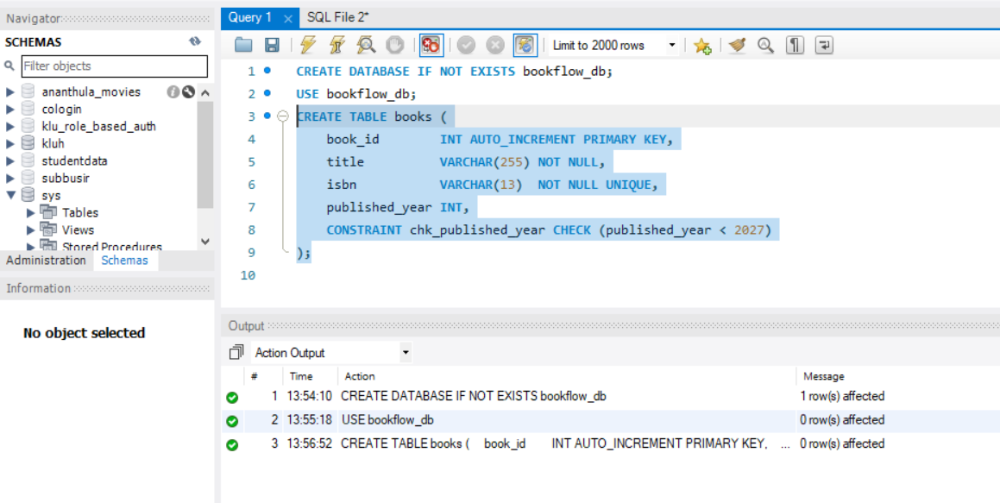
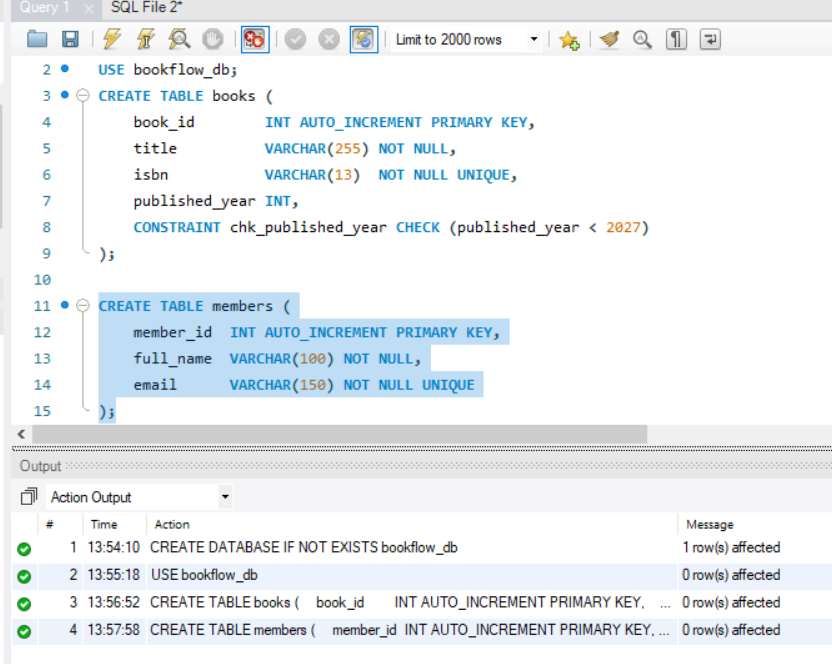
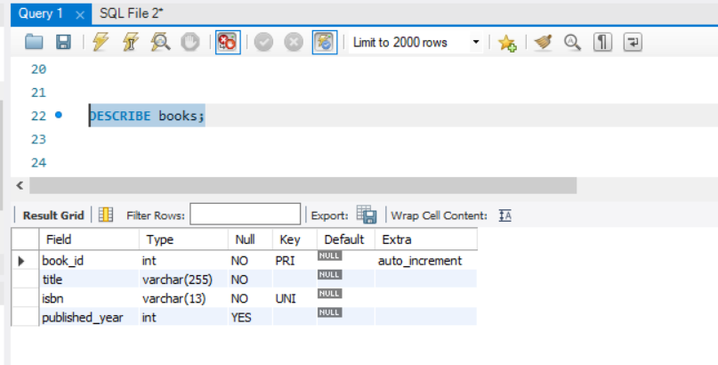
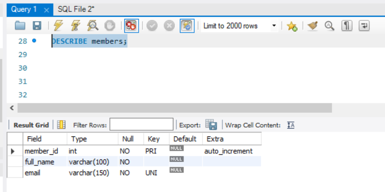
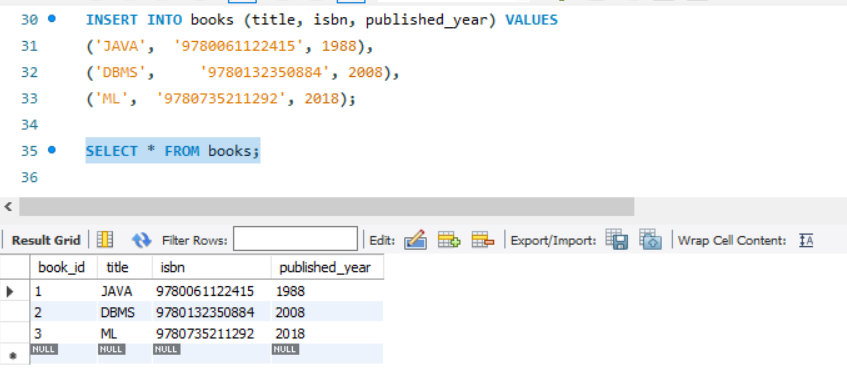
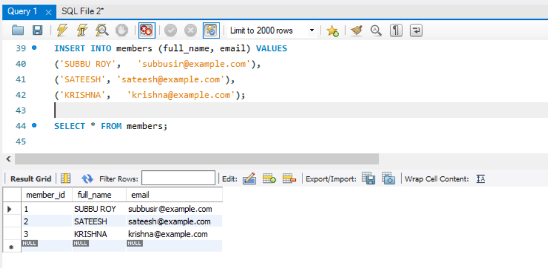
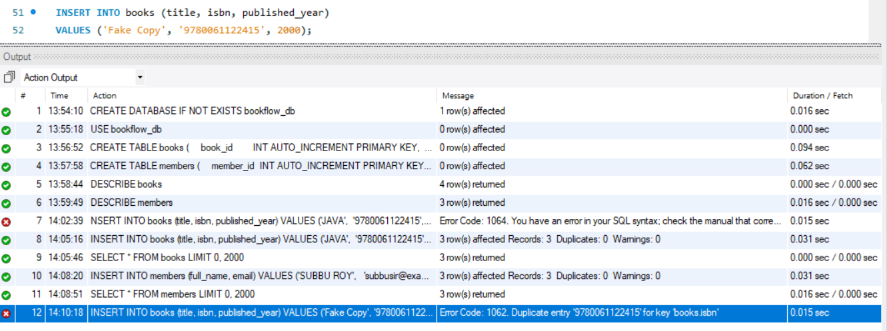
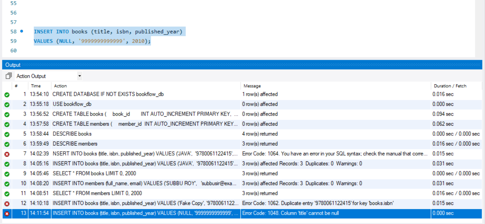

# Week 1 — BookFlow: DDL, Schema Definition & Constraints

**Course:** Database System Engineering and Distributed Backend Development
**Course Code:** 25CS1302E

---

## Problem Statement

A local library manages its books and members in a physical notebook, which has led to
misplaced books, difficulty tracking borrowed items, and inaccurate member records.
To modernize its operations the library wants a database system called **BookFlow**.

Create a database `bookflow_db` with two tables:

- `books` — `book_id`, `title`, `isbn`, `published_year`
- `members` — `member_id`, `full_name`, `email`

Enforce `PRIMARY KEY` on both IDs, `NOT NULL` on `title`, `UNIQUE` on `isbn` and `email`,
and a `CHECK` constraint so `published_year` is not in the future (`< 2027`).
Seed three records into each table to verify the structure and the constraints.

---

## Files

| File | Description |
|------|-------------|
| [`week01_bookflow.sql`](week01_bookflow.sql) | Complete, runnable SQL script for the whole practical |
| [`screenshots/`](screenshots/) | MySQL Workbench output for every step |
| [`screenshots/mysql-workbench-installation/`](screenshots/mysql-workbench-installation/) | Step-by-step MySQL Workbench installation on Windows |
| [`reference-week1-practical.pdf`](reference-week1-practical.pdf) | Original lab handout |

---

## Step 1 — Database Setup

```sql
CREATE DATABASE IF NOT EXISTS bookflow_db;
```

`CREATE DATABASE` builds a new, empty container for tables. `IF NOT EXISTS` makes the
statement safe to re-run — MySQL skips creation instead of raising an error.



```sql
USE bookflow_db;
```

`USE` switches the session to `bookflow_db`, so every following `CREATE TABLE`,
`INSERT` and `SELECT` runs inside this database.



---

## Step 2 — Table Creation (DDL) with Constraints

```sql
CREATE TABLE books (
    book_id        INT AUTO_INCREMENT PRIMARY KEY,
    title          VARCHAR(255) NOT NULL,
    isbn           VARCHAR(13)  NOT NULL UNIQUE,
    published_year INT,
    CONSTRAINT chk_published_year CHECK (published_year < 2027)
);
```

- `book_id INT AUTO_INCREMENT PRIMARY KEY` — uniquely identifies each row; automatically
  `NOT NULL` and `UNIQUE`. `AUTO_INCREMENT` generates 1, 2, 3, … so the ID is never typed manually.
- `title VARCHAR(255) NOT NULL` — a book cannot be saved without a name.
- `isbn VARCHAR(13) NOT NULL UNIQUE` — no two books share an ISBN. `VARCHAR` is used instead
  of `INT` because ISBNs can have leading zeros and ISBN-10 can end in the letter `X`.
- `CHECK (published_year < 2027)` — the named constraint `chk_published_year` rejects any
  year of 2027 or later, keeping "future" books out of the catalogue.



```sql
CREATE TABLE members (
    member_id  INT AUTO_INCREMENT PRIMARY KEY,
    full_name  VARCHAR(100) NOT NULL,
    email      VARCHAR(150) NOT NULL UNIQUE
);
```

`NOT NULL` on `email` means no signup without an email; `UNIQUE` means one account per
email address. Together they satisfy the rule *"no member can sign up without a valid email."*



---

## Verification — `DESCRIBE`

```sql
DESCRIBE books;
DESCRIBE members;
```

`DESCRIBE` prints the schema. `Key = PRI` confirms the `PRIMARY KEY`, `Key = UNI` confirms
`UNIQUE`, and `Null = NO` confirms the `NOT NULL` columns — this is how an examiner verifies
the constraints actually exist.




---

## Step 3 — Seeding Valid Data

```sql
INSERT INTO books (title, isbn, published_year) VALUES
('JAVA', '9780061122415', 1988),
('DBMS', '9780132350884', 2008),
('ML',   '9780735211292', 2018);

SELECT * FROM books;
```

One multi-row `INSERT` adds three books. `book_id` is omitted on purpose — `AUTO_INCREMENT`
assigns 1, 2, 3. All three rows pass every constraint.



```sql
INSERT INTO members (full_name, email) VALUES
('SUBBU ROY', 'subbusir@example.com'),
('SATEESH',   'sateesh@example.com'),
('KRISHNA',   'krishna@example.com');

SELECT * FROM members;
```



---

## Step 4 — Constraint Tests (These MUST Fail)

Each statement deliberately violates one rule. A correct schema rejects all four, and the
error message is the proof that data integrity works.

### Test 1 — Duplicate ISBN (`UNIQUE` violation)

```sql
INSERT INTO books (title, isbn, published_year)
VALUES ('Fake Copy', '9780061122415', 2000);
```

```
ERROR 1062 (23000): Duplicate entry '9780061122415' for key 'books.isbn'
```



### Test 2 — NULL title (`NOT NULL` violation)

```sql
INSERT INTO books (title, isbn, published_year)
VALUES (NULL, '9999999999999', 2010);
```

```
ERROR 1048 (23000): Column 'title' cannot be null
```



### Test 3 — Future publication year (`CHECK` violation)

```sql
INSERT INTO books (title, isbn, published_year)
VALUES ('Time Traveler', '8888888888888', 2030);
```

```
ERROR 3819 (HY000): Check constraint 'chk_published_year' is violated.
```

### Test 4 — Duplicate email (`UNIQUE` violation)

```sql
INSERT INTO members (full_name, email)
VALUES ('Subbu Clone', 'subbusir@example.com');
```

```
ERROR 1062 (23000): Duplicate entry 'subbusir@example.com' for key 'members.email'
```

---

## Constraint Cheat Sheet

| Constraint | Applied On | Purpose | Error If Violated |
|------------|------------|---------|-------------------|
| `PRIMARY KEY` | `book_id`, `member_id` | Unique row identity; `NOT NULL` + `UNIQUE` combined | 1062 Duplicate entry |
| `NOT NULL` | `title`, `isbn`, `full_name`, `email` | Column must always have a value | 1048 Column cannot be null |
| `UNIQUE` | `isbn`, `email` | No two rows may share the value | 1062 Duplicate entry |
| `CHECK` | `published_year < 2027` | Value must satisfy a condition | 3819 Check constraint violated |
| `AUTO_INCREMENT` | `book_id`, `member_id` | Auto-generates sequential IDs | — (a convenience, not a rule) |

---

## Skills Demonstrated

- **Schema definition** — real-world objects (Books, Members) mapped to tables with correct
  data types (`INT` for IDs and years, `VARCHAR` for text and ISBN).
- **Data integrity** — `UNIQUE`, `NOT NULL` and `CHECK` constraints proven to reject bad data
  through four deliberately failing inserts.
- **DDL proficiency** — `CREATE DATABASE`, `CREATE TABLE`, `DESCRIBE` and multi-row `INSERT`
  executed and verified end to end.

---

## How to Run

1. Open **MySQL Workbench** → connect to your local instance → **File → New Query Tab**.
2. Run queries 1–7 in order, then the four failing tests.
3. Show the `DESCRIBE` output, the `SELECT` result grids, and the four error messages as proof.

Installing MySQL Workbench on Windows is documented step by step in
[`screenshots/mysql-workbench-installation/`](screenshots/mysql-workbench-installation/)
(download: <https://dev.mysql.com/downloads/workbench/>).
