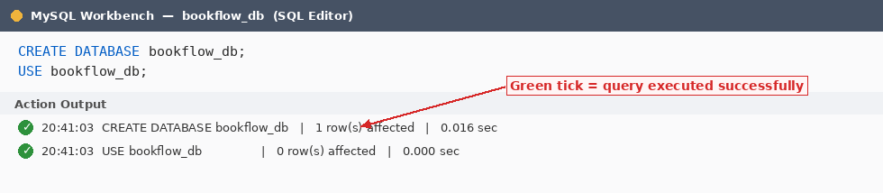
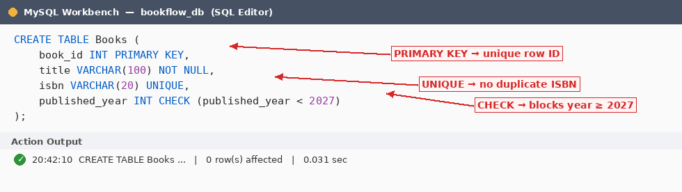
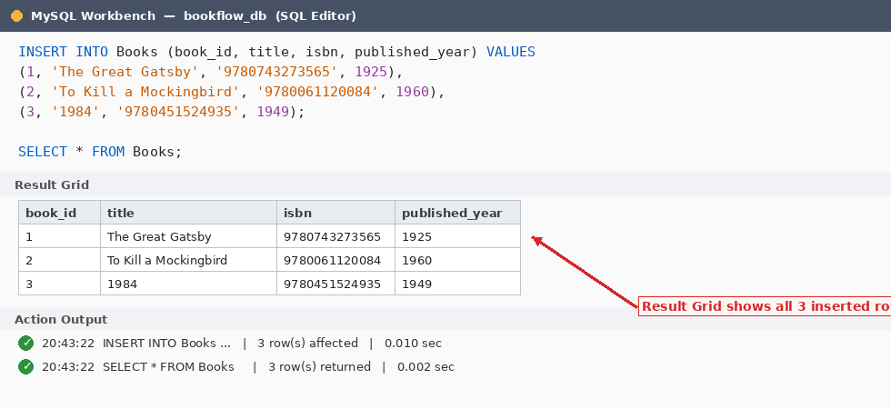
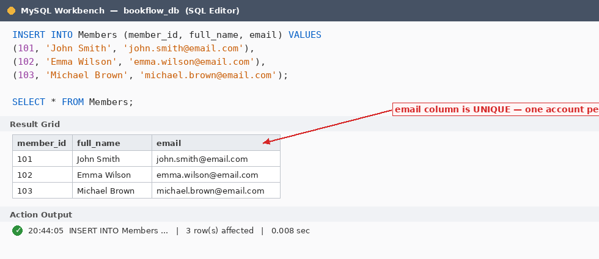
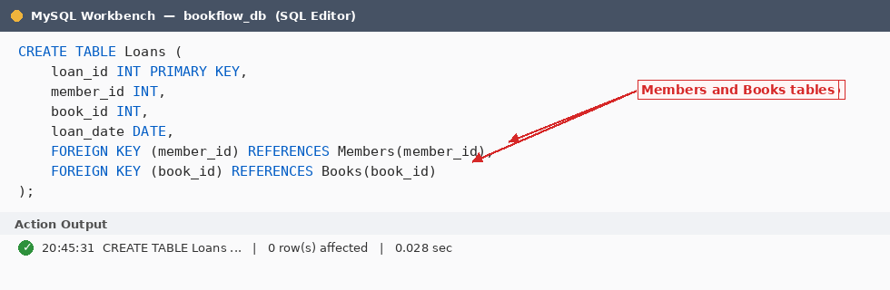
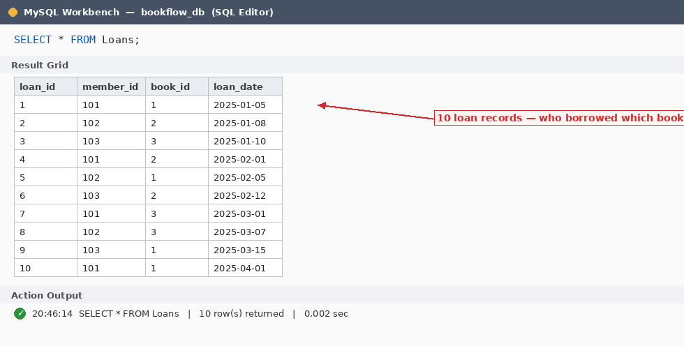
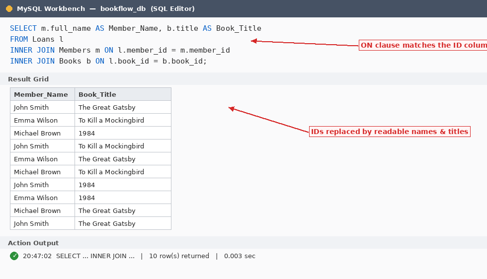
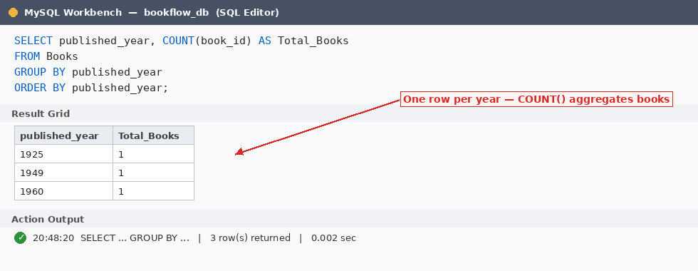
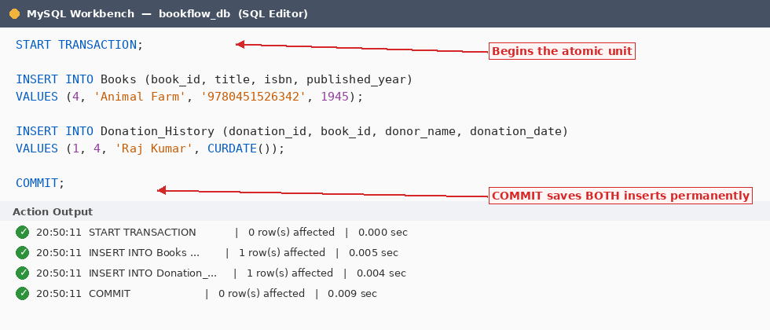
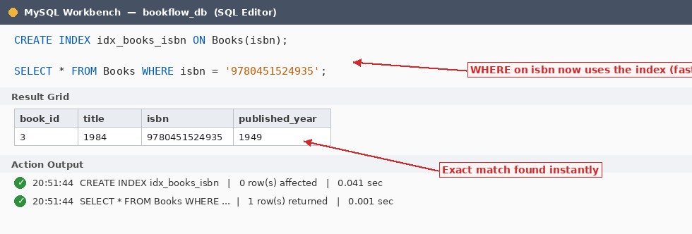

# Week 2 — The Librarian's Dashboard: JOINs, Aggregations, Transactions & Indexing

**Course:** Database System Engineering and Distributed Backend Development
**Course Code:** 25CS1302E

---

## Scenario

The library is now digital. The head librarian needs a report to see which members are
active and which books are in the collection. A **Book Donation** process must also add a
new book and log the donation at the exact same time — if one part fails, the whole process
must stop so the catalogue stays accurate.

### Tasks

1. **The Catalog Search (JOINs)** — create a third table `Loans` connecting `member_id` to
   `book_id`; query the Member Name and the Book Title they have borrowed.
2. **Collection Stats (Aggregations)** — find the total number of books published in each year.
3. **The Donation Transaction (ACID)** — use `START TRANSACTION … COMMIT` to add a book and
   log it in `Donation_History` simultaneously.
4. **Search Speed (Indexing)** — create an index on `isbn` and explain why ISBN search is now
   faster than searching by title.

---

## Files

| File | Description |
|------|-------------|
| [`week02_bookflow.sql`](week02_bookflow.sql) | Complete, runnable SQL script for the whole practical |
| [`screenshots/`](screenshots/) | MySQL Workbench output, Fig 1 – Fig 10 |
| [`reference-week2-practical.pdf`](reference-week2-practical.pdf) | Original lab handout |

---

## Step 1 — Create Database

```sql
CREATE DATABASE bookflow_db;
USE bookflow_db;
```

`CREATE DATABASE` builds the empty container that will hold all four tables; `USE` activates
it so every following query runs inside it. In Workbench, the green tick in the **Action
Output** panel is the proof of successful execution.



---

## Step 2 — Books Table (DDL + Constraints)

```sql
CREATE TABLE Books (
    book_id        INT PRIMARY KEY,
    title          VARCHAR(100) NOT NULL,
    isbn           VARCHAR(20) UNIQUE,
    published_year INT CHECK (published_year < 2027)
);
```

- `PRIMARY KEY (book_id)` — uniquely identifies every book; automatically `NOT NULL` + `UNIQUE`.
- `NOT NULL (title)` — a book cannot be saved without a name.
- `UNIQUE (isbn)` — no two books share an ISBN, solving the lost/duplicate book problem.
- `CHECK (published_year < 2027)` — rejects any future year, preventing garbage data.



---

## Steps 3 & 4 — Insert Books and Display

```sql
INSERT INTO Books (book_id, title, isbn, published_year) VALUES
(1, 'The Great Gatsby',      '9780743273565', 1925),
(2, 'To Kill a Mockingbird', '9780061120084', 1960),
(3, '1984',                  '9780451524935', 1949);

SELECT * FROM Books;
```

One multi-row `INSERT` adds three books; Action Output reports *"3 row(s) affected"*. All rows
pass every constraint — unique ISBNs, non-null titles, years below 2027.



---

## Steps 5, 6 & 7 — Members Table: Create, Insert, Display

```sql
CREATE TABLE Members (
    member_id INT PRIMARY KEY,
    full_name VARCHAR(100),
    email     VARCHAR(100) UNIQUE
);

INSERT INTO Members (member_id, full_name, email) VALUES
(101, 'John Smith',    'john.smith@email.com'),
(102, 'Emma Wilson',   'emma.wilson@email.com'),
(103, 'Michael Brown', 'michael.brown@email.com');

SELECT * FROM Members;
```

`PRIMARY KEY` on `member_id` gives each member a unique identity. `UNIQUE` on `email` enforces
one account per email — a second signup with `john.smith@email.com` fails with **ERROR 1062**.



---

## Step 8 — Loans Table (Foreign Keys)

```sql
CREATE TABLE Loans (
    loan_id   INT PRIMARY KEY,
    member_id INT,
    book_id   INT,
    loan_date DATE,
    FOREIGN KEY (member_id) REFERENCES Members(member_id),
    FOREIGN KEY (book_id)   REFERENCES Books(book_id)
);
```

`Loans` is the **junction (linking) table** — it records WHO borrowed WHICH book and WHEN,
which is the library's core problem. Each `FOREIGN KEY` means a loan can only reference a
member or a book that actually exists. This is **referential integrity** — no "ghost" loans.



---

## Steps 9 & 10 — Insert 10 Loans and Display

```sql
INSERT INTO Loans (loan_id, member_id, book_id, loan_date) VALUES
(1,  101, 1, '2025-01-05'),  (2,  102, 2, '2025-01-08'),
(3,  103, 3, '2025-01-10'),  (4,  101, 2, '2025-02-01'),
(5,  102, 1, '2025-02-05'),  (6,  103, 2, '2025-02-12'),
(7,  101, 3, '2025-03-01'),  (8,  102, 3, '2025-03-07'),
(9,  103, 1, '2025-03-15'),  (10, 101, 1, '2025-04-01');

SELECT * FROM Loans;
```

Every `member_id` (101–103) and `book_id` (1–3) already exists in the parent tables, so all ten
inserts pass the foreign key checks. Using `member_id` 999 would be rejected with
**ERROR 1452 — a foreign key constraint fails**.



---

## Step 11 — JOIN Query (Who Borrowed What)

```sql
SELECT m.full_name AS Member_Name,
       b.title     AS Book_Title
FROM Loans l
INNER JOIN Members m ON l.member_id = m.member_id
INNER JOIN Books   b ON l.book_id   = b.book_id;
```

`Loans` only stores IDs (101, 1). `INNER JOIN` pulls the matching `full_name` from `Members`
and `title` from `Books` using the `ON` conditions. Aliases (`l`, `m`, `b`) shorten the query
and `AS` renames the output columns. 10 loans in → 10 readable rows out.



---

## Step 12 — GROUP BY Query (Books per Year)

```sql
SELECT published_year,
       COUNT(book_id) AS Total_Books
FROM Books
GROUP BY published_year
ORDER BY published_year;
```

`GROUP BY` collapses rows sharing the same `published_year` into one group, `COUNT(book_id)`
counts the books inside each group, and `ORDER BY` sorts the years ascending.

> **Exam rule:** every non-aggregated column in `SELECT` (here `published_year`) must appear in `GROUP BY`.



---

## Steps 13–16 — Donation via Transaction (Atomicity)

```sql
CREATE TABLE Donation_History (
    donation_id   INT PRIMARY KEY,
    book_id       INT,
    donor_name    VARCHAR(100),
    donation_date DATE,
    FOREIGN KEY (book_id) REFERENCES Books(book_id)
);

START TRANSACTION;

INSERT INTO Books (book_id, title, isbn, published_year)
VALUES (4, 'Animal Farm', '9780451526342', 1945);

INSERT INTO Donation_History (donation_id, book_id, donor_name, donation_date)
VALUES (1, 4, 'Raj Kumar', CURDATE());

COMMIT;
```

A donated book must appear in **both** `Books` and `Donation_History` — never in just one.
`START TRANSACTION` groups the two inserts into one atomic unit and `COMMIT` saves both
permanently; had anything failed mid-way, `ROLLBACK` would undo everything. This is the
**A (Atomicity)** in ACID.

> Workbench has auto-commit ON by default; `START TRANSACTION` temporarily overrides it until
> `COMMIT` or `ROLLBACK`.



**`Donation_History` after COMMIT**

| donation_id | book_id | donor_name | donation_date |
|---|---|---|---|
| 1 | 4 | Raj Kumar | 2025-07-14 |

---

## Steps 17 & 18 — Index on ISBN + Fast Search

```sql
CREATE INDEX idx_books_isbn ON Books(isbn);

SELECT * FROM Books WHERE isbn = '9780451524935';
```

An index works like a book's alphabetical index — instead of scanning every row (full table
scan), MySQL jumps straight to the matching ISBN via a **B-tree lookup**. On 4 rows the
difference is invisible, but on 4 million books it turns seconds into milliseconds. The search
returns exactly one row: `book_id` 3, *"1984"*.

> **Exam tip:** the `UNIQUE` constraint on `isbn` already created an internal index;
> `idx_books_isbn` demonstrates explicit index creation as the task asked.



---

## Final State of All Tables

**Books**

| book_id | title | isbn | published_year |
|---|---|---|---|
| 1 | The Great Gatsby | 9780743273565 | 1925 |
| 2 | To Kill a Mockingbird | 9780061120084 | 1960 |
| 3 | 1984 | 9780451524935 | 1949 |
| 4 | Animal Farm | 9780451526342 | 1945 |

**Members**

| member_id | full_name | email |
|---|---|---|
| 101 | John Smith | john.smith@email.com |
| 102 | Emma Wilson | emma.wilson@email.com |
| 103 | Michael Brown | michael.brown@email.com |

**Loans**

| loan_id | member_id | book_id | loan_date |
|---|---|---|---|
| 1 | 101 | 1 | 2025-01-05 |
| 2 | 102 | 2 | 2025-01-08 |
| 3 | 103 | 3 | 2025-01-10 |
| 4 | 101 | 2 | 2025-02-01 |
| 5 | 102 | 1 | 2025-02-05 |
| 6 | 103 | 2 | 2025-02-12 |
| 7 | 101 | 3 | 2025-03-01 |
| 8 | 102 | 3 | 2025-03-07 |
| 9 | 103 | 1 | 2025-03-15 |
| 10 | 101 | 1 | 2025-04-01 |

**Donation_History**

| donation_id | book_id | donor_name | donation_date |
|---|---|---|---|
| 1 | 4 | Raj Kumar | 2025-07-14 |

---

## Exam Cheat Sheet

| Concept | Where Used | One-Line Answer for Viva |
|---------|-----------|--------------------------|
| `PRIMARY KEY` | All 4 tables | Unique row identity; `NOT NULL` + `UNIQUE` combined |
| `NOT NULL` | `Books.title` | Column can never be empty |
| `UNIQUE` | `isbn`, `email` | No duplicates allowed in the column |
| `CHECK` | `published_year < 2027` | Value must satisfy the condition |
| `FOREIGN KEY` | `Loans`, `Donation_History` | Child value must exist in the parent table |
| `INNER JOIN` | Step 11 | Returns only rows that match in both tables |
| `GROUP BY` + `COUNT` | Step 12 | Aggregates rows into groups and counts them |
| `TRANSACTION` | Step 14 | All-or-nothing: `COMMIT` saves, `ROLLBACK` undoes |
| `INDEX` | Step 17 | B-tree lookup — fast `WHERE` search on big tables |

---

## Viva Questions & Answers

**1. What is the purpose of the `Loans` table in the BookFlow database?**
`Loans` acts as a junction (bridge) table between `Members` and `Books`. It stores borrowing
transactions and tracks which member borrowed which book and on what date.

**2. Why do we use JOIN operations in SQL?**
`JOIN` combines data from two or more related tables on a common column. Here it displays
member names and book titles together by connecting `Members`, `Loans` and `Books`.

**3. What is the purpose of the `GROUP BY` clause?**
`GROUP BY` groups rows that share the same value in a specified column. It is used with
aggregate functions such as `COUNT()`, `SUM()` and `AVG()` — here, to count books per year.

**4. What is a Transaction, and why is it important?**
A transaction is a sequence of SQL operations treated as a single unit of work. Either all
operations complete (`COMMIT`) or none are applied (`ROLLBACK`), maintaining consistency and integrity.

**5. Why is an Index created on the ISBN column?**
To improve search performance. Since ISBN values are unique and frequently searched, the
database locates records far faster using the index instead of scanning every row.

---

## Assignments

### Problem Statement 1 — SkyTrack Airline Management System

A regional airline manages flight schedules, passenger records and ticket bookings in
spreadsheets. Build a database `skytrack_db` with three tables: `Flights`
(`flight_id`, `flight_number`, `source`, `destination`, `departure_date`, `ticket_price`),
`Passengers` (`passenger_id`, `passenger_name`, `email`) and `Bookings` (connecting the two via
foreign keys). Apply `PRIMARY KEY`, `UNIQUE` and `CHECK` constraints, insert at least 10 records
per table, display all contents, and write an `INNER JOIN` showing passenger name, flight number,
source and destination for every booking. Report the total number of flights per destination with
`COUNT()` and `GROUP BY`. Create a `Flight_History` table and demonstrate a transaction that adds
a flight and records the history entry together. Finally create an index on `flight_number` and
explain why searching by flight number is faster than searching by destination.

### Problem Statement 2 — MediCare Hospital Management System

A hospital maintains patient records, doctor information and appointment schedules manually.
Build a database `medicare_db` with three tables: `Doctors` (`doctor_id`, `doctor_name`,
`specialization`, `consultation_fee`), `Patients` (`patient_id`, `patient_name`, `email`) and
`Appointments` (connecting doctors and patients via foreign keys, with an appointment date).
Apply `PRIMARY KEY`, `UNIQUE` and `CHECK` constraints, insert at least 10 records per table,
display all contents, and write an `INNER JOIN` showing patient name, doctor name, specialization
and appointment date. Report the number of doctors per specialization with `COUNT()` and
`GROUP BY`. Create a `Doctor_History` table and demonstrate a transaction that registers a new
doctor and records the registration together. Finally create an index on `specialization` and
explain how indexing improves search performance.

---

## How to Run in MySQL Workbench

1. Open Workbench → connect to **Local instance** → **File → New Query Tab**.
2. Paste each step's query → press the lightning-bolt button or `Ctrl+Enter`.
3. Read results in the **Result Grid**; confirm success via the green tick in **Action Output**.
